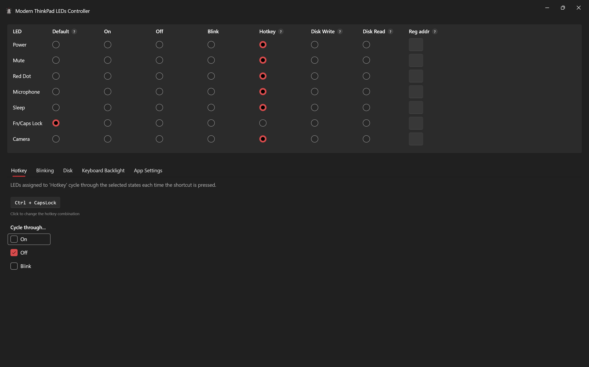

<!-- markdownlint-disable-next-line MD033 MD041 -->

# Modern ThinkPad LEDs Controller

## What is it?

**Modern ThinkPad LEDs Controller** is a full rework of the legacy [ThinkPadLEDControl](https://github.com/valinet/ThinkPadLEDControl).

It offers a **nicer WPF UI**, and more importantly **ditches the dated, unsecure WinRing0** for the modern [PawnIO](https://pawnio.eu/) driver (also used by newer versions of FanControls and OpenRGG).

It also adds:

- a proper hotkey feature
- blinking for all LEDs (does not rely on HW support)
- full keyboard backlight level control
- custom LED register addresses config
- support for modern LEDs
- polling perf optimisations

## Installation

1. Download the latest release from the [releases page](https://github.com/stanlrt/modern-thinkpad-leds-controller/releases).
2. Follow your browser's prompt to keep and open the file. They might offer to delete it since it isn't common or signed.
3. Follow the installation prompts.
4. When the app starts, grant admin privileges. They are required to control the LEDs securely via PawnIO.
5. If you do not yet have [PawnIO](https://pawnio.eu/) installed and running, the app will offer to install it.
6. You can close the app. It will minimise to the taskbar tray.;

## A note about BSODs

### Disclaimer

This app makes no guarantee that it will not cause BSODs. It directly communicates with the EC registers. I cannot assure that it is bug-free, nor that PawnIO is. I am not responsible in any way for any damage to your system.

### Safe mode

If you need to troubleshoot instability, start the app with `--safe-mode` or `--no-hardware`.

- The UI still opens.
- PawnIO is not loaded.
- No EC reads or writes are attempted.

You can also turn hardware access off from the App Settings tab. Turning it off applies immediately for the current session and persists for the next launch. Turning it back on requires a restart.

### Recovery

In case you face a BSOD, here is my recommendation. Since the issue will likely be linked to the EC regs, you must fully drain them. This can usually be performed by unplugging your computer from a power source other than its battery, and disconnecting the battery from the components, either using the pinhole or by long-pressing the power button. Instructions depend on your computer build/laptop model.
