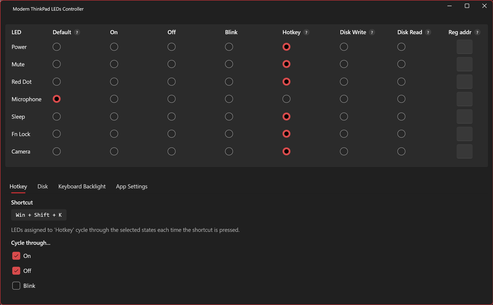

# Modern ThinkPad LEDs Controller

## What is it?

**Modern ThinkPad LEDs Controller** is a full rework of the legacy [ThinkPadLEDControl](https://github.com/valinet/ThinkPadLEDControl).

It offers a **nicer WPF UI**, and more importantly **ditches the dated, unsecure WinRing0** for the modern [PawnIO](https://pawnio.eu/) driver (also used by newer versions of FanControls and OpenRGG).

It also adds:

- a proper hotkey feature
- full keyboard backlight level control
- custom LED register addresses config
- support for modern LEDs
- polling perf optimisations

## Installation

1. Download the latest release from the [releases page](https://github.com/stanlrt/modern-thinkpad-leds-controller/releases).
2. Follow your browser's prompt to keep and open the file. They might offer to delete it since it isn't common or signed.
3. Follow the installation prompts.
4. When the app starts, grant admin privileges. They are required to control the LEDs securely via PawnIO.
5. If you do not yet have [PawnIO](https://pawnio.eu/) installed and running, the app will offer to install it.
6. The app will automatically start after PawnIO is running.
7. If you want it to start with Windows later, enable that option from the app settings.
8. You can close the app. It will minimise to the taskbar tray.

